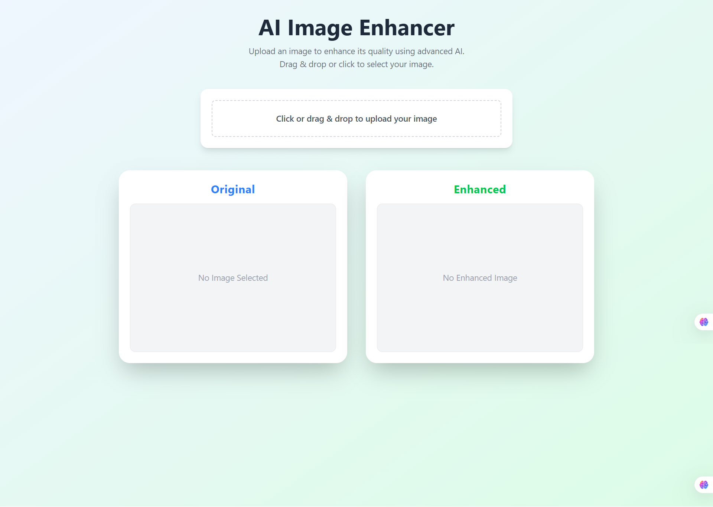

# AI Image Enhancer

A web application that enhances the quality of your images using advanced AI, built with React, Vite, and TailwindCSS.

## Features

- Upload images via drag & drop or file picker
- Enhances image quality using an external AI API
- Side-by-side comparison of original and enhanced images
- Download the enhanced image
- Responsive and modern UI

## Demo

 <!-- Replace with actual screenshot if available -->

## Getting Started

### Prerequisites

- [Node.js](https://nodejs.org/) (v18 or newer recommended)
- [npm](https://www.npmjs.com/) or [yarn](https://yarnpkg.com/)

### Installation

```sh
git clone https://github.com/your-username/enhancer-ai.git
cd enhancer-ai
npm install
```

### Running Locally

```sh
npm run dev
```

Open [http://localhost:5173](http://localhost:5173) in your browser.

### Building for Production

```sh
npm run build
```

### Linting

```sh
npm run lint
```

## Project Structure

```
src/
  App.jsx
  main.jsx
  index.css
  components/
    Home.jsx
    ImageUpload.jsx
    ImagePreview.jsx
    Loading.jsx
  utils/
    enhanceImageApi.js
```

## API

This app uses the [techhk.aoscdn.com](https://techhk.aoscdn.com/) API for image enhancement. You may need to provide your own API key for production use.
